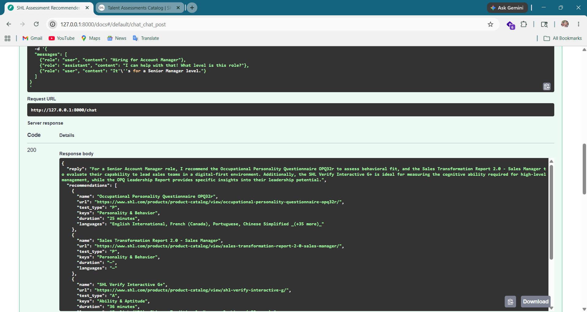

# SHL Assessment Recommender

A high-precision, stateless conversational API for recommending SHL assessments based on specific hiring needs and job descriptions.



## 🚀 Overview

The **SHL Assessment Recommender** is an intelligent backend service that helps recruiters and hiring managers find the most relevant assessments from the SHL catalog. It employs a **Hybrid Retrieval Pipeline** (BM25s + Domain-Specific Heuristics) and **Gemini 3.1 Flash-Lite** for natural language understanding, ensuring strict adherence to the official assessment catalog.

## ✨ Key Features

- **Stateless Architecture**: No database or session state. The full conversation history is passed in each `/chat` request, enabling horizontal scalability.
- **Hybrid Retrieval Pipeline**: 
  - **BM25s**: Modern, fast lexical search for keyword matching.
  - **Domain Heuristics**: 17+ custom boost rules for specific job families (Java/Backend, Frontend, Leadership, Graduate, Retail, Sales, etc.).
- **Strict Catalog Adherence**: Recommendations are resolved against a static dataset of 370+ assessments. The AI never invents assessments or URLs.
- **Advanced Intent Handling**: Tiered classification logic for clarifications, refinements (adding/removing assessments), and comparisons.
- **Safety & Guardrails**: Built-in protection against prompt injections and automatic redirection for off-topic queries (e.g., pricing, legal advice).

## 🛠️ Tech Stack

- **Framework**: [FastAPI](https://fastapi.tiangolo.com/) (Python 3.12)
- **AI Engine**: [Google Gemini 3.1 Flash-Lite](https://ai.google.dev/) via [google-genai SDK](https://googleapis.github.io/python-genai/)
- **Search Engine**: [BM25s](https://bm25s.github.io/)
- **Data Handling**: [Pydantic v2](https://docs.pydantic.dev/), [NumPy](https://numpy.org/)
- **Reliability**: [Tenacity](https://tenacity.readthedocs.io/)
- **Environment**: [python-dotenv](https://github.com/theskumar/python-dotenv)

## 🚦 Getting Started

### Prerequisites
- Python 3.12+
- A Google AI Studio API Key

### Installation

1. **Clone the repository**:
   ```bash
   git clone <repository-url>
   cd conversational-shl-assessment-recommender
   ```

2. **Install dependencies**:
   ```bash
   cd backend
   pip install -r requirements.txt
   ```

3. **Configure Environment**:
   Create a `.env` file in the root directory (or `backend/`):
   ```env
   GEMINI_API_KEY=your_api_key_here
   MODEL_NAME=gemini-3.1-flash-lite
   PORT=8000
   CATALOG_PATH=data/shl_catalog.json
   ```

4. **Run the API**:
   ```bash
   # From the backend directory
   uvicorn app.main:app --reload
   ```

## 📂 Project Structure

```text
.
├── assets/             # Demo screenshots and media
├── backend/
│   ├── app/
│   │   ├── agent.py      # Core agent logic and intent routing
│   │   ├── catalog.py    # Catalog loader and data access
│   │   ├── eval.py       # Automated evaluation suite
│   │   ├── main.py       # FastAPI application and routes
│   │   ├── prompts.py    # Gemini system prompts
│   │   ├── retrieval.py  # Hybrid search engine (BM25s + Boosts)
│   │   └── schemas.py    # Pydantic request/response models
│   └── requirements.txt  # Python dependencies
├── data/
│   └── shl_catalog.json  # Official SHL assessment catalog (377 items)
├── approach.md         # Technical implementation details
└── README.md           # This file
```

## 📖 API Documentation

### `POST /chat`

The primary endpoint for conversational recommendations.

**Request Payload:**
```json
{
  "messages": [
    {
      "role": "user",
      "content": "I'm hiring a Senior Java Developer with Spring Boot experience."
    }
  ]
}
```

**Response Schema:**
```json
{
  "reply": "For a Senior Java Developer, I recommend the Java (Experienced) Knowledge test and the OPQ32r for personality fit...",
  "recommendations": [
    {
      "name": "Java (Experienced)",
      "url": "https://www.shl.com/product-catalog/view/java-experienced/",
      "test_type": "Knowledge",
      "keys": "Knowledge & Skills",
      "duration": "30 minutes",
      "languages": "English, French, Spanish"
    }
  ],
  "end_of_conversation": false
}
```

## 🧪 Evaluation

The project includes an automated test runner to evaluate the agent across 10+ complex conversational traces:

```bash
python backend/app/eval.py
```

---
*Built for the SHL Assessment Ecosystem with precision-first AI.*
